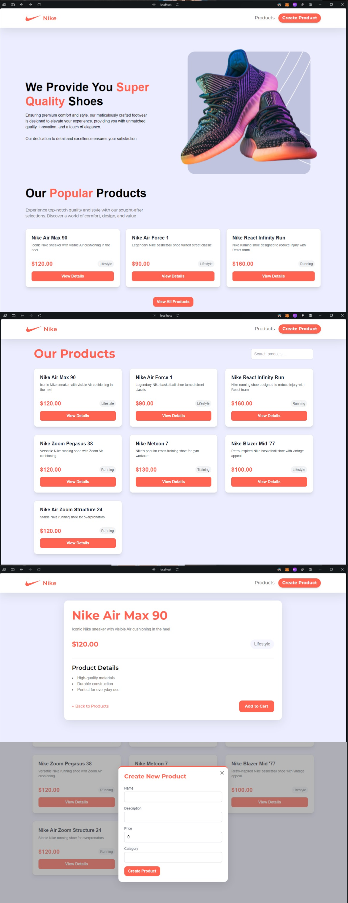

# E-commerce Product Catalog

This project is a simple e-commerce product catalog application with a React frontend and an Express.js backend.



## Prerequisites

- Node.js (v14 or later)
- npm (v6 or later)

## Project Structure

The project is set up as a monorepo with two main packages:

- `packages/frontend`: React frontend
- `packages/backend`: Express.js backend

## Setup and Installation

1. Clone the repository:

   ```
   git clone <repository-url>
   cd ecommerce-monorepo
   ```

2. Install dependencies:

   ```
   npm install
   ```

3. Set up the backend:

   ```
   cd packages/backend
   npm install
   ```

4. Set up the frontend:
   ```
   cd packages/frontend
   npm install
   ```

## Running the Application

1. Start the backend server:

   ```
   cd packages/backend
   npm run dev
   ```

   The server will start on `http://localhost:3000`.

2. In a new terminal, start the frontend development server:
   ```
   cd packages/frontend
   npm run dev
   ```
   The frontend will be available at `http://localhost:5173`.

## Features

- View a list of products
- Search for products
- View detailed product information
- Create new products
- Responsive design

## Assumptions

1. The backend uses an in-memory SQLite database, which resets on server restart.
2. The frontend uses Vite as the build tool and development server.
3. Authentication and user management are not implemented in this version.
4. The application assumes a stable internet connection for API requests.
5. The product images are not handled in this version; only textual data is managed.
6. The application is designed for modern browsers and may not support older versions.

## Technologies Used

- Frontend:

  - React
  - TypeScript
  - Tailwind CSS
  - React Query (TanStack Query)
  - React Router

- Backend:
  - Express.js
  - TypeScript
  - Drizzle ORM
  - SQLite (in-memory)

## Contributing

Please read [CONTRIBUTING.md](CONTRIBUTING.md) for details on our code of conduct and the process for submitting pull requests.

## License

This project is licensed under the MIT License - see the [LICENSE.md](LICENSE.md) file for details.
